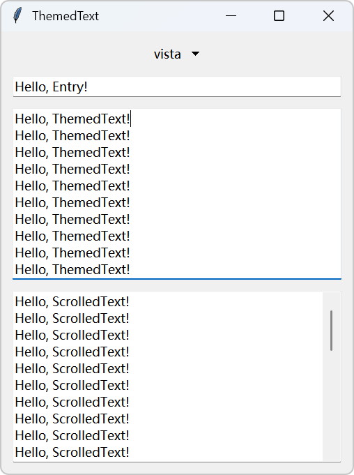
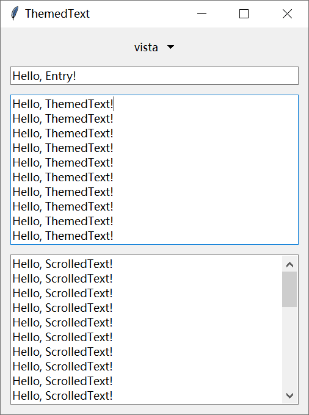
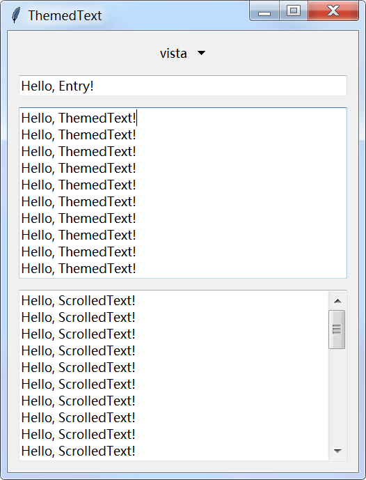

<div align="center">

# 主题化 Tkinter 文本控件

**仓库：**
[][repository-github]
[][repository-gitcode]

**语言**：
**简体中文** |
[English](./README.md) |
<small>期待您的翻译！</small>

</div>

支持现代主题样式的 Tkinter Text 组件。

[](./CODE_OF_CONDUCT.zh-CN.md)
[](./LICENSE)
[](https://github.com/hellotool/ttk-text/actions/workflows/testing.yml)

[](https://pypi.org/project/ttk-text/)

## 特性

- 🎨 支持主题感知的文本组件，可自动适配 ttk 主题
- 📜 内置 ScrolledText 组件，支持垂直/水平滚动条
- 🖥️ 原生集成 ttk 样式和主题
- 🔄 支持动态主题切换

## 屏幕截图

<div>



</div>

Windows 11、Windows 10 和 Windows 7 的示例截图。

## 使用指南

### 安装

您可以使用您喜欢的包管理器安装 ttk-text。

由于 ttk-text 目前并不稳定，我强烈建议您**将 ttk-text 安装到虚拟环境中并固定精确版本**，避免出现版本冲突。

```bash
# 使用 pip
pip install ttk-text

# 使用 uv
uv add ttk-text

# 使用 PDM
pdm add ttk-text

# 使用 Poetry
poetry add ttk-text
```

### 使用组件

ttk-text 提供了三个组件：

- `ttk_text.ThemedTextFrame`: 用于渲染文本框样式的 Frame，此组件将绑定一个 Text。
- `ttk_text.ThemedText`: 支持主题的 Text 组件，替代 `tkinter.Text`。
- `ttk_text.scrolled_text.ScrolledText`: `ThemedText` 的扩展，支持垂直/水平滚动条，替代 `tkinter.scrolledtext.ScrolledText`。

#### 使用 `ThemedText` 与 `ScrolledText`

您可以像使用 `tkinter.Text` 一样使用 `ThemedText` 和 `ScrolledText`。

这是一个示例：

```python
from tkinter import Tk

from ttk_text import ThemedText
from ttk_text.scrolled_text import ScrolledText

root = Tk()

themed_text = ThemedText(root)
themed_text.pack(fill="both", expand=True, padx="7p", pady="7p")

scrolled_text = ScrolledText(root)
scrolled_text.pack(fill="both", expand=True, padx="7p", pady=(0, "7p"))

root.mainloop()
```

> [!NOTE]
>
> 目前，ttk style 的属性会覆盖您设置的 `selectbackground` 等属性。

#### 为 `ThemedText` 与 `ScrolledText` 添加额外组件

`ThemedText` 自身实际上并不负责主题化，而是将自己包装在 `ThemedTextFrame` 中，让 `ThemedTextFrame` 负责主题化，您可以通过 `ThemedText#frame` 获取到该 `ThemedTextFrame`。

`ThemedText` 会将自身使用 grid 布局放置在 `ThemedText#frame` 的 (1, 1) 位置。

`ThemedText#frame` 的布局如下：

| 索引  |   0   |      1       |   2   |
| :---: | :---: | :----------: | :---: |
|   0   |       |              |       |
|   1   |       | `ThemedText` |       |
|   2   |       |              |       |

`ScrolledText` 还会添加滚动条和使角落衔接处美观的 Frame。

`ScrolledText#frame` 的布局如下：

| 索引  |   0   |                1                 |               2                |
| :---: | :---: | :------------------------------: | :----------------------------: |
|   0   |       |                                  |                                |
|   1   |       |           `ThemedText`           | `Scrollbar(orient="vertical")` |
|   2   |       | `Scrollbar(orient="horizontal")` |            `Frame`             |

您可以像 `ScrolledText` 一样在 (1, 1) 周围放置其他组件，并调用 `ThemedText#frame.bind_widget()` 来绑定该组件。

#### 使用 `ThemedTextFrame`

您可以使用 `ThemedTextFrame` 来实现第三方 Text 组件的主题化。

在添加完毕后，您需要调用 `ThemedText#frame.bind_text()` 来绑定第三方 Text 组件。

例如使用 `tkinter.scrolledtext.ScrolledText`：

```python
import tkinter.scrolledtext
from tkinter import Tk

from ttk_text import ThemedTextFrame

root = Tk()

text_frame = ThemedTextFrame(root)
text_frame.pack(fill="both", expand=True, padx="7p", pady="7p")
text_frame.grid_rowconfigure(1, weight=1)
text_frame.grid_columnconfigure(1, weight=1)

text = tkinter.scrolledtext.ScrolledText(text_frame)
text.grid(row=1, column=1, sticky="nsew")

text_frame.bind_text(text)

root.mainloop()
```

> [!NOTE]
>
> `ThemedTextFrame` 内部需要使用 grid 布局，**您不能使用 pack 或 place 布局**。

### 配置样式

您可以使用样式名 `ThemedText.TEntry` 来配置样式。

| 属性               | 说明                       |
| ------------------ | -------------------------- |
| `borderwidth`      | `ThemedTextFrame` 边框宽度 |
| `padding`          | `ThemedTextFrame` 内边距   |
| `fieldbackground`  | `Text` 背景色              |
| `foreground`       | `Text` 字体色              |
| `textpadding`      | `Text` 外边距              |
| `insertwidth`      | `Text` 光标宽度            |
| `selectbackground` | `Text` 选中背景色          |
| `selectforeground` | `Text` 选中字体色          |

例如，将边框设置为 `1.5p`：

```python
from tkinter.ttk import Style

style = Style()
style.configure("ThemedText.TEntry", borderwidth="1.5p")
```

### 主题兼容性

部分第三方主题可能与 ttk-text 不兼容，您可以在设置主题后调用以下函数来修复该问题：

<details>
<summary>Sun Valley ttk theme</summary>

```python
from tkinter import Tk
from tkinter.ttk import Style
import sv_ttk


def fix_sv_ttk(style: Style):
    if sv_ttk.get_theme() == "light":
        style.configure("ThemedText.TEntry", fieldbackground="#fdfdfd", textpadding=5)
        style.map(
            "ThemedText.TEntry",
            fieldbackground=[
                ("hover", "!focus", "#f9f9f9"),
            ],
        )
    else:
        style.configure("ThemedText.TEntry", fieldbackground="#292929", textpadding=5)
        style.map(
            "ThemedText.TEntry",
            fieldbackground=[
                ("hover", "!focus", "#2f2f2f"),
                ("focus", "#1c1c1c"),
            ],
        )


# 示例
app = Tk()
sv_ttk.set_theme("light")
fix_sv_ttk(Style())
app.mainloop()
```

</details>

<details>
<summary>Azure-ttk-theme</summary>

```python
from tkinter import Tk
from tkinter.ttk import Style


def fix_azure_ttk(style: Style):
    if style.theme_use() == "azure-light":
        style.configure("ThemedText.TEntry", fieldbackground="#ffffff", textpadding=5)
    else:
        style.configure("ThemedText.TEntry", fieldbackground="#333333", textpadding=5)


# 示例
app = Tk()
app.tk.call("source", "azure.tcl")
Style().theme_use("azure-light")
app.tk.call("set_theme", "light")
fix_azure_ttk(Style())
app.mainloop()
```

</details>

<details>
<summary>Forest-ttk-theme</summary>

```python
from tkinter import Tk
from tkinter.ttk import Style


def fix_forest_ttk(style: Style):
    if style.theme_use() == "forest-light":
        style.configure("ThemedText.TEntry", fieldbackground="#ffffff", textpadding=5, font="TkTextFont")
    else:
        style.configure("ThemedText.TEntry", fieldbackground="#313131", textpadding=5, font="TkTextFont")


# 示例
app = Tk()
app.tk.call("source", "external-themes/forest-ttk-theme/forest-light.tcl")
Style().theme_use("forest-light")
fix_forest_ttk(Style())
app.mainloop()
```

</details>

## 参与贡献

详情请参阅 [CONTRIBUTING.md（英文）](./CONTRIBUTING.md)。

## 许可证

本项目使用 MIT 许可证，查看 [LICENSE](./LICENSE) 了解更多信息。

[repository-github]: https://github.com/hellotool/ttk-text/
[repository-gitcode]: https://gitcode.com/hellotool/ttk-text/
